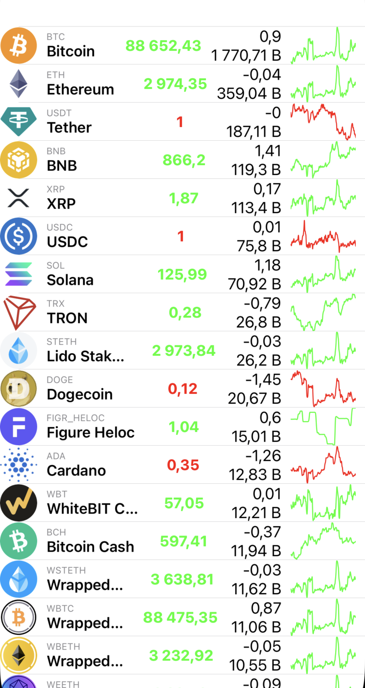
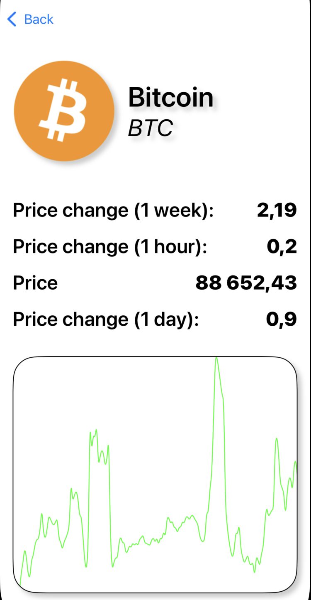

# 🦎 CoinGecko iOS App

An iOS application that displays cryptocurrency market data using the **CoinGecko API**.

The project focuses on clean architecture, modern UIKit APIs, and real-world iOS development patterns such as networking, caching, and performance-aware UI updates.

---

## ✨ Features

- 📈 Cryptocurrency list with live prices
- 📊 Detailed coin screen with 7-day sparkline price chart
- 🔄 Pull-to-refresh support
- 🗂 Diffable Data Source for smooth UI updates
- 💾 Caching layer to reduce network requests
- 🌐 Async/Await networking
- 🎨 UIKit-based UI with Auto Layout
- 🧱 Clean architecture & separation of concerns

---

## 🛠 Tech Stack

- Swift
- UIKit
- Async / Await
- UICollectionViewDiffableDataSource
- URLSession
- URLCache / in-memory caching
- Dependency Injection
- Kingfisher (image loading)
- CoinGecko Public API

---

## 🧩 Architecture

The project follows a layered architecture inspired by **Clean Architecture** principles:

- **Presentation** — ViewControllers, Views, UI logic
- **Domain** — Models, use cases, protocols
- **Data** — Network services and caching implementations
- **Infrastructure** — Configuration, shared services, secrets handling

This structure keeps business logic independent from UI and external frameworks, improving testability and long-term maintainability.

---

## 🚀 Getting Started

1. Clone the repository
2. Add `COINGECKO_API_KEY` to `Info.plist`
3. Open the project in Xcode
4. Run on an iOS 15+ simulator or device

---

## 🔐 API Key Handling

The CoinGecko API key is **not hardcoded**.

It is stored in `Info.plist` and accessed through a dedicated configuration layer:

```swift
Secrets.coinGeckoAPIKey
```
## 📌 Notes

This project was created as a **portfolio showcase** to demonstrate:

- modern UIKit development
- async/await concurrency
- clean architectural boundaries
- networking and caching strategies
- performance-aware UI updates

The application is not intended to be a production trading tool.

---

## 📷 Screenshots

<table>
  <tr>
    <td align="center">
      <br>
      <b>Coins List view</b>
    </td>
    <td align="center">
      <br>
      <b>Coin Details view</b>
    </td>
  </tr>
</table>

---

## 👤 Author

Developed by **Denis**  
iOS Developer · Swift · UIKit
